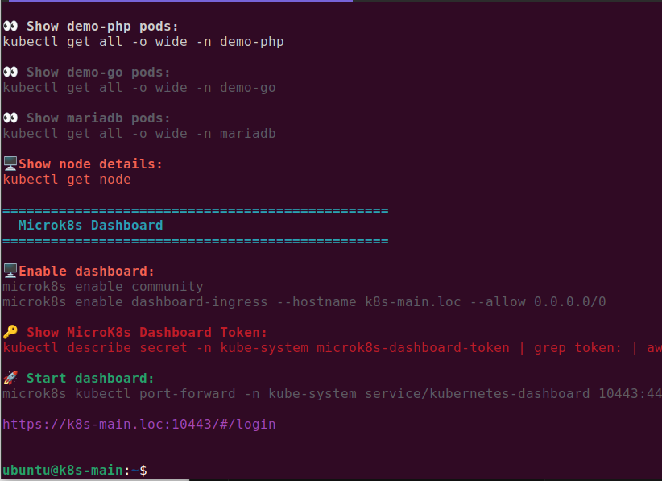
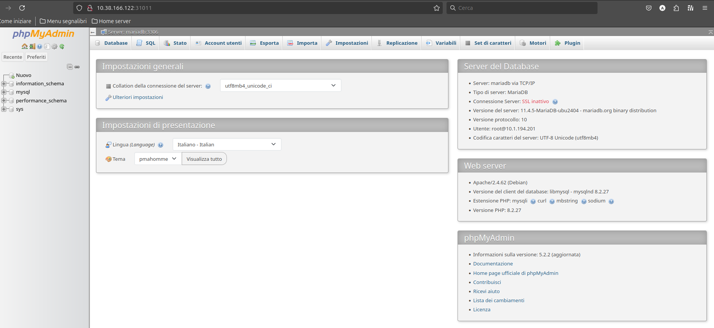
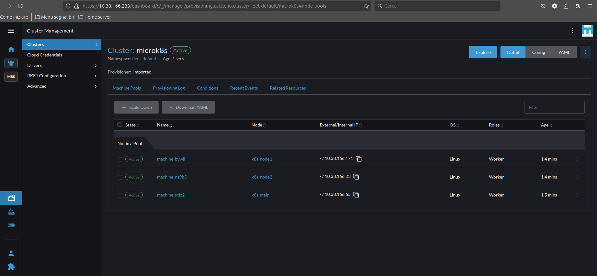
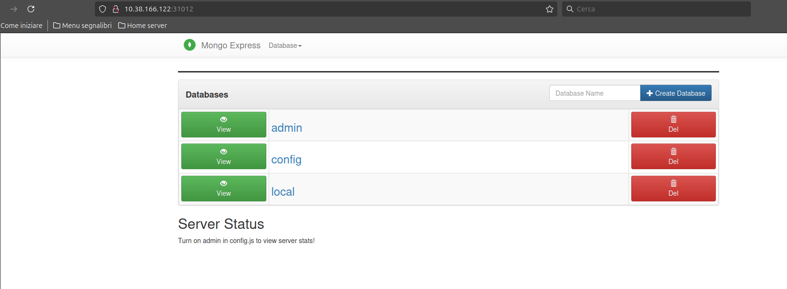
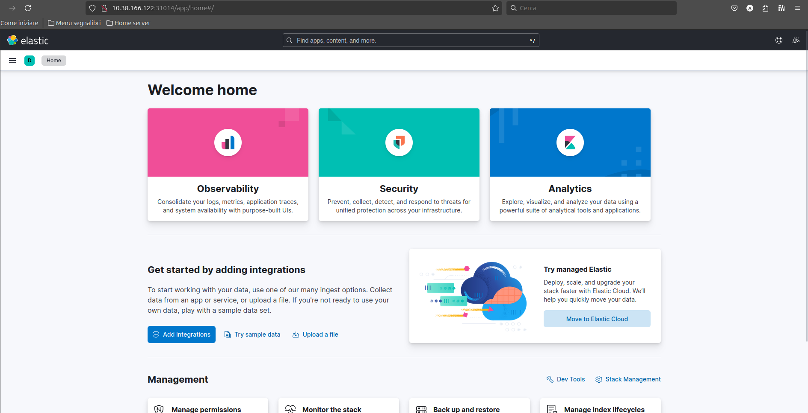
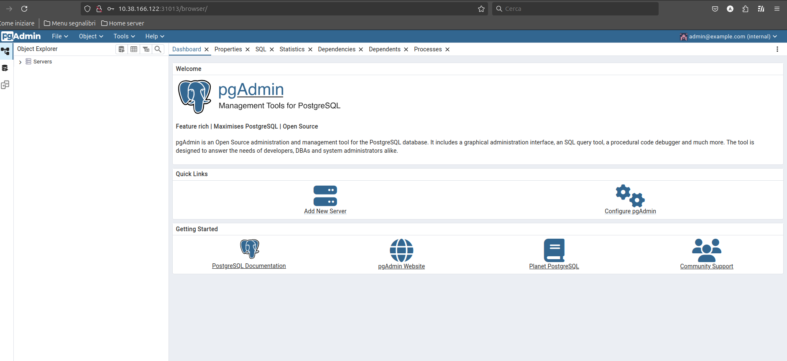
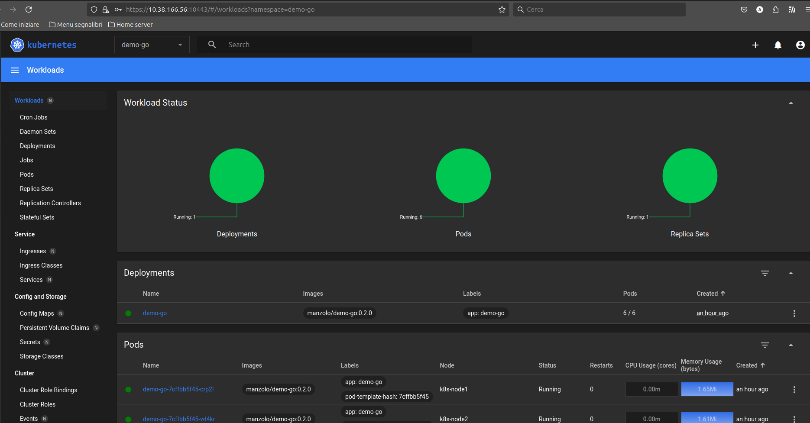
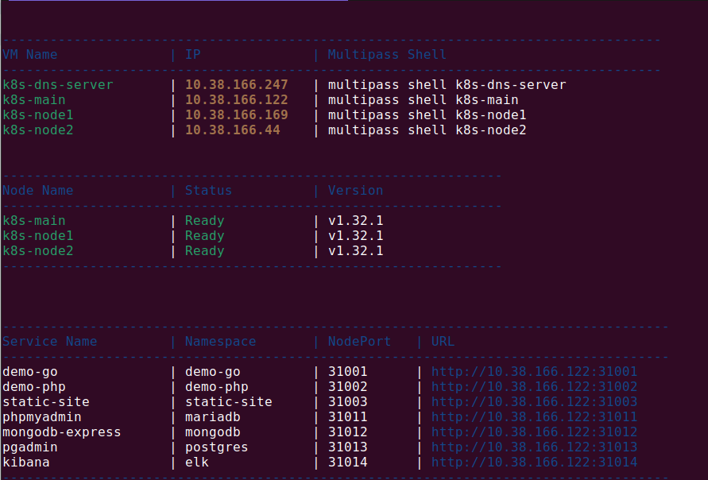

# Multipass MicroK8s Cluster Demo

[](https://github.com/manzolo/multipass-microk8s-cluster-demo/actions/workflows/ci.yml)
[](https://opensource.org/licenses/MIT)
[](https://ubuntu.com/)
[](https://microk8s.io/)

A local Kubernetes playground using [MicroK8s](https://microk8s.io) on [Multipass](https://multipass.run/) VMs. Create a multi-node cluster with an interactive menu in minutes.

Inspired by [Olawepo Olayemi](https://sejuba.medium.com/installing-kubernetes-microk8-cluster-on-multipass-vms-59978830692d).

## Features

- Interactive menu for cluster management
- Multi-node Kubernetes cluster (1 main + N workers)
- Local DNS server for service discovery
- Pre-configured stacks: MariaDB, PostgreSQL, MongoDB, Redis, RabbitMQ, ELK, Jenkins
- Optional Nginx load balancer and Rancher

## Architecture Overview

This project creates a complete local Kubernetes environment with multiple VMs working together:

```
┌─────────────────────────────────────────────────────────────────────────┐
│                           Host Machine                                  │
│                    (DNS configured for *.loc domains)                   │
└───────────────────────────────┬─────────────────────────────────────────┘
                                │
┌───────────────────────────────┴─────────────────────────────────────────┐
│                        Multipass VM Network                             │
│                                                                         │
│  ┌─────────────┐   ┌─────────────┐   ┌─────────────┐   ┌─────────────┐  │
│  │  DNS Server │   │  Main Node  │   │   Worker 1  │   │   Worker N  │  │
│  │ (k8s-dns)   │   │  (k8s-main) │   │ (k8s-node1) │   │ (k8s-nodeN) │  │
│  │             │   │             │   │             │   │             │  │
│  │  dnsmasq    │◄──│ Control     │──►│  Kubelet    │   │  Kubelet    │  │
│  │  *.loc      │   │ Plane       │   │  Pods       │   │  Pods       │  │
│  └─────────────┘   └─────────────┘   └─────────────┘   └─────────────┘  │
│                                                                         │
│  ┌─────────────┐   ┌─────────────┐                                      │
│  │  NGINX LB   │   │   Rancher   │  (Optional components)               │
│  │ (nginx-lb)  │   │             │                                      │
│  │             │   │  Container  │                                      │
│  │  Reverse    │   │  Management │                                      │
│  │  Proxy      │   │  UI         │                                      │
│  └─────────────┘   └─────────────┘                                      │
└─────────────────────────────────────────────────────────────────────────┘
```

### Cluster Creation

The cluster creation process is fully automated and follows this sequence:

1. **DNS Server** - A lightweight VM running `dnsmasq` is created first, providing name resolution for all cluster services (e.g., `demo-go.loc`, `mariadb.loc`)

2. **Main Node** - The control plane VM is created with MicroK8s installed. This node runs the Kubernetes API server, scheduler, and controller manager

3. **Template Cloning** - The main node is cloned to create a template, ensuring all worker nodes have identical configurations

4. **Worker Nodes** - Each worker is cloned from the template and automatically joins the cluster using a token from the main node

5. **Stack Deployment** - Selected application stacks are deployed as Kubernetes manifests with proper namespaces, services, and ingress rules

### DNS Server

The DNS server enables seamless service discovery:

- Runs `dnsmasq` on a dedicated lightweight VM (1 CPU, 1GB RAM)
- Manages the `.loc` domain (configurable via `DNS_SUFFIX`)
- Each VM and service is automatically registered with DNS
- Your host machine is configured to resolve `*.loc` domains through this server
- Unknown domains are forwarded to public DNS (Cloudflare/Google)

**Example**: After deploying the demo-go stack, you can access it at `http://demo-go.loc`

### Load Balancer

The optional NGINX load balancer distributes traffic across worker nodes:

- Runs on a separate VM as a reverse proxy
- Automatically configured with upstream groups for each deployed service
- Routes requests based on hostname to the appropriate NodePort service
- Provides a single entry point for all cluster services

**Traffic flow**: `Request → nginx-lb → k8s-node1:31001, k8s-node2:31001, ...`

### Available Stacks

Deploy production-like services with a single command:

| Category | Stacks |
|----------|--------|
| **Demo Apps** | Go web app, PHP web app, Static site |
| **Databases** | MariaDB + PhpMyAdmin, PostgreSQL + PgAdmin, MongoDB + Mongo Express, Redis + Commander |
| **Messaging** | RabbitMQ |
| **Monitoring** | ELK Stack (Elasticsearch, Logstash, Kibana), Grafana |
| **DevOps** | Jenkins, Gitea |
| **Applications** | Ghost, Nextcloud, MinIO, Node-RED |

Each stack creates its own namespace with all required resources (Deployments, Services, Secrets, ConfigMaps).

### Rancher (Optional)

For a graphical cluster management experience, deploy Rancher:

- Runs as a Docker container on a dedicated VM
- Provides a web UI for managing Kubernetes resources
- Monitor deployments, pods, and cluster health visually

## Quick Start

```bash
git clone https://github.com/manzolo/multipass-microk8s-cluster-demo.git
cd multipass-microk8s-cluster-demo
./menu.sh
```

## Prerequisites

- Linux with [Multipass](https://multipass.run/) installed
- Git

## Compatibility

| Ubuntu | MicroK8s |
|--------|----------|
| 24.04  | 1.28 - 1.35+ |
| 22.04  | 1.25 - 1.35+ |
| 20.04  | 1.20 - 1.32 |
| 18.04  | 1.18 - 1.32 |

Configure versions in `.env`:
```bash
UBUNTU_VERSION=22.04
MICROK8S_VERSION=1.32
```

## Documentation

See [docs/README.md](docs/README.md) for detailed usage.

## Demo

[](https://www.youtube.com/watch?v=60-j3D5CzHg)

## Screenshots










