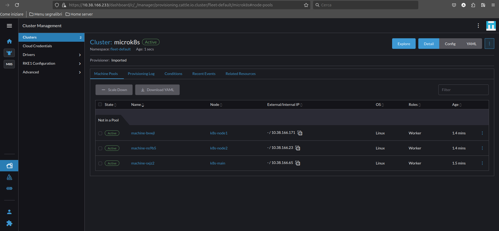
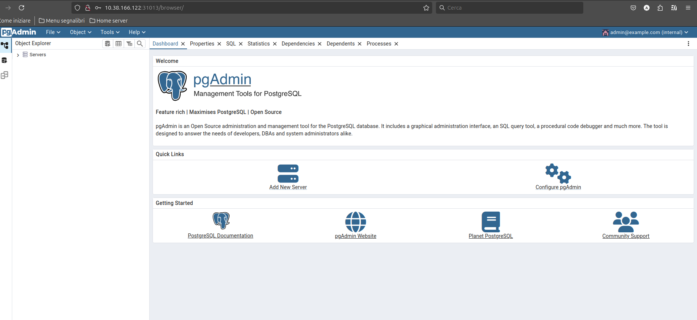

# Multipass microk8s cluster demo
This is a demonstration of creating a [microk8s](https://microk8s.io) kubernetes playground cluster inside [multipass](https://multipass.run/) virtual machines

From an idea of [Olawepo Olayemi](https://sejuba.medium.com/installing-kubernetes-microk8-cluster-on-multipass-vms-59978830692d)

## Prerequisites
* [Ubuntu 24.04](https://ubuntu.com/download)
* [multipass](https://multipass.run/)
* Git

## Tested on
* Ubuntu 24.04 
* Microk8s (1.31/stable)

## Try it yourself
* [Main menu](docs/README.md)

## Demo video

## Screenshot

