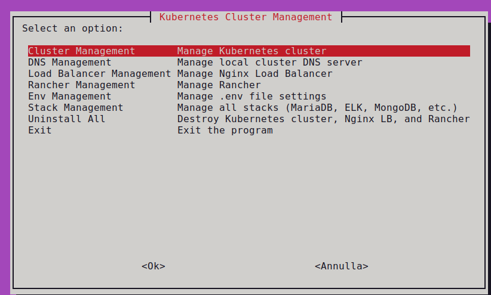
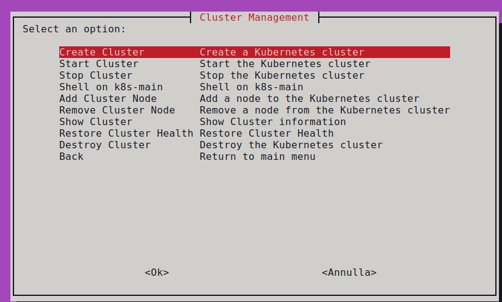
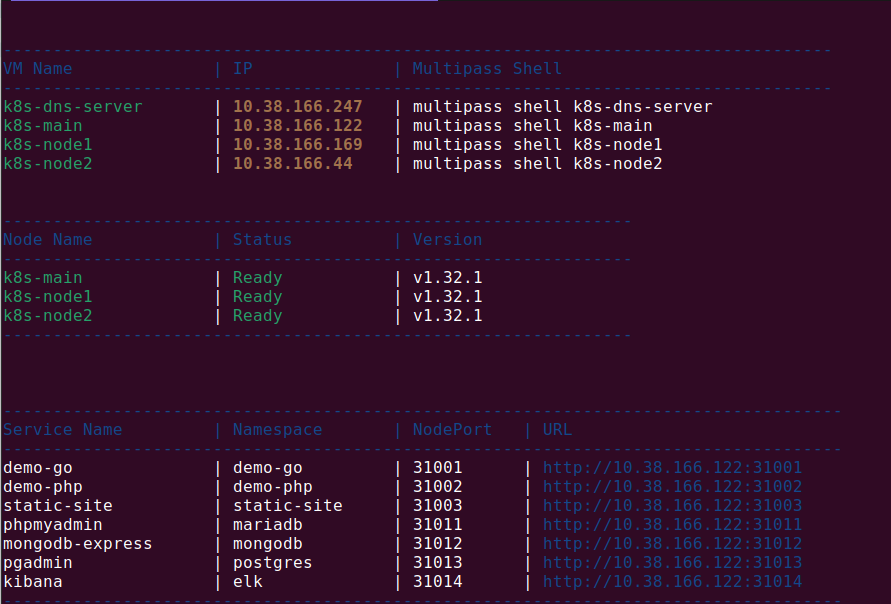
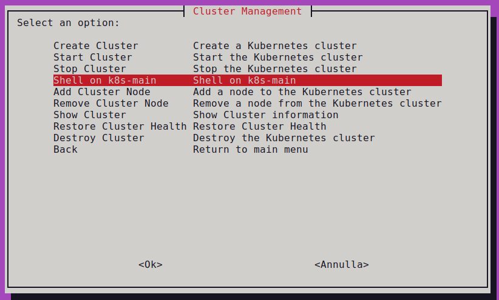
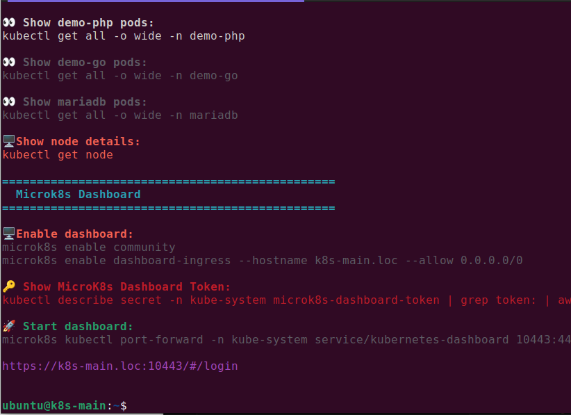
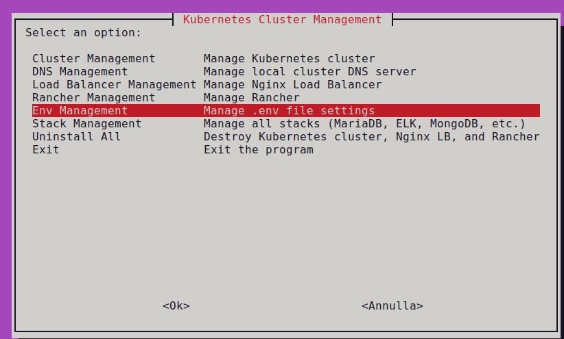
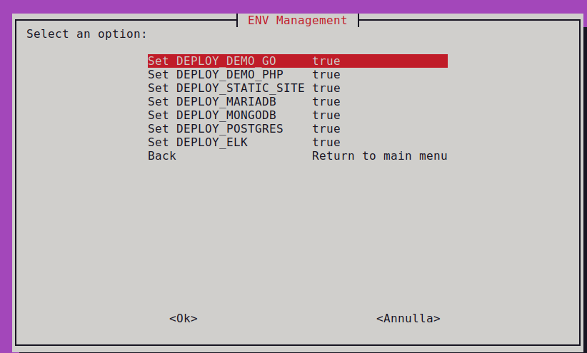

# MicroK8s Cluster Demo Setup

This repository demonstrates how to set up a MicroK8s cluster and deploy various application stacks.

## Getting Started

1.  **Clone the Repository:**

    ```bash
    git clone https://github.com/manzolo/multipass-microk8s-cluster-demo.git
    cd multipass-microk8s-cluster-demo
    ./main.sh
    ```

2.  **Main Menu:**

    

## Documentation

This directory contains documentation for deploying and managing different application stacks.

**Select a stack to test:**

* [MariaDB](mariadb/README.md)
* [PostgreSQL](postgres/README.md)
* [MongoDB](mongodb/README.md)
* [ELK](elk/README.md) (requires more RAM; see documentation for details)

## Cluster Installation

1.  **Initiate Installation:**

    

2.  **Installation Log:**
    <details>
    
    

    

    
        <summary>Full Log</summary>
        
        $ ./create_kube_vms.sh
        Script started at: 28/02/2025 23:09:25
        Checking prerequisites...
        Creating DNS VM: k8s-dns-server
        Launched: k8s-dns-server
        Installing dnsmasq on k8s-dns-server
        dnsmasq: syntax check OK.
        Add k8s-dns-server MOTD
        DNS VM k8s-dns-server is ready!
        Creating VM: k8s-main
        Launched: k8s-main
        Name:           k8s-main
        State:          Running
        Snapshots:      0
        IPv4:           10.38.166.122
        Release:        Ubuntu 20.04.6 LTS
        Image hash:     8d73e811f51e (Ubuntu 20.04 LTS)
        CPU(s):         2
        Load:           0.40 0.10 0.03
        Disk usage:     1.6GiB out of 19.3GiB
        Memory usage:   163.8MiB out of 3.8GiB
        Mounts:         --
        Configuring DNS resolver on k8s-main to use k8s-dns-server (10.38.166.247)
        Add k8s-main.loc -> 10.38.166.122 to DNS on k8s-dns-server
        k8s-main.loc added successfully to DNS on k8s-dns-server!
        Riavvio di dnsmasq su k8s-dns-server
        === Task 1: k8s-main Setup ===
        microk8s (1.32/stable) v1.32.1 from Canonical✓ installed
        snap "microk8s" is already installed, see 'snap help refresh'
        Added:
        - microk8s.helm as helm
        Added:
        - microk8s.helm3 as helm3
        Added:
        - microk8s.kubectl as kubectl
        Added:
        - microk8s.kubectl as k
        Infer repository core for addon hostpath-storage
        Enabling default storage class.
        WARNING: Hostpath storage is not suitable for production environments.
                A hostpath volume can grow beyond the size limit set in the volume claim manifest.

        deployment.apps/hostpath-provisioner created
        storageclass.storage.k8s.io/microk8s-hostpath created
        serviceaccount/microk8s-hostpath created
        clusterrole.rbac.authorization.k8s.io/microk8s-hostpath created
        clusterrolebinding.rbac.authorization.k8s.io/microk8s-hostpath created
        Storage will be available soon.
        Waiting for microk8s to be ready...
        Checking prerequisites...
        Cloning VM: k8s-node1
        Clone VM: k8s-main -> k8s-node1
        Cloned from k8s-main to k8s-node1.
        Cloning VM: k8s-node2
        Clone VM: k8s-node1 -> k8s-node2
        Cloned from k8s-node1 to k8s-node2.
        Configuring VM nodes...
        Waiting for microk8s to be ready on k8s-node1...
        MicroK8s is ready on k8s-node1.
        Configuring DNS resolver on k8s-node1 to use k8s-dns-server (10.38.166.247)
        Add k8s-node1.loc -> 10.38.166.169 to DNS on k8s-dns-server
        k8s-node1.loc added successfully to DNS on k8s-dns-server!
        Riavvio di dnsmasq su k8s-dns-server
        Name:           k8s-node1
        State:          Running
        Snapshots:      0
        IPv4:           10.38.166.169
        Release:        Ubuntu 20.04.6 LTS
        Image hash:     8d73e811f51e (Ubuntu 20.04 LTS)
        CPU(s):         2
        Load:           0.94 0.21 0.07
        Disk usage:     2.2GiB out of 19.3GiB
        Memory usage:   415.7MiB out of 3.8GiB
        Mounts:         --
        Waiting for microk8s to be ready on k8s-main...
        MicroK8s is ready on k8s-main.
        Generating join cluster command for k8s-main
        Installing microk8s on k8s-node1
        WARNING: Hostpath storage is enabled and is not suitable for multi node clusters.

        Contacting cluster at 10.38.166.122

        The node has joined the cluster and will appear in the nodes list in a few seconds.

        This worker node gets automatically configured with the API server endpoints.
        If the API servers are behind a loadbalancer please set the '--refresh-interval' to '0s' in:
            /var/snap/microk8s/current/args/apiserver-proxy
        and replace the API server endpoints with the one provided by the loadbalancer in:
            /var/snap/microk8s/current/args/traefik/provider.yaml

        Successfully joined the cluster.
        MicroK8s joined successfully on k8s-node1.
        Waiting for microk8s to be ready on k8s-node2...
        MicroK8s is ready on k8s-node2.
        Configuring DNS resolver on k8s-node2 to use k8s-dns-server (10.38.166.247)
        Add k8s-node2.loc -> 10.38.166.44 to DNS on k8s-dns-server
        k8s-node2.loc added successfully to DNS on k8s-dns-server!
        Riavvio di dnsmasq su k8s-dns-server
        Name:           k8s-node2
        State:          Running
        Snapshots:      0
        IPv4:           10.38.166.44
        Release:        Ubuntu 20.04.6 LTS
        Image hash:     8d73e811f51e (Ubuntu 20.04 LTS)
        CPU(s):         2
        Load:           0.71 0.16 0.05
        Disk usage:     2.2GiB out of 19.3GiB
        Memory usage:   416.9MiB out of 3.8GiB
        Mounts:         --
        Waiting for microk8s to be ready on k8s-main...
        MicroK8s is ready on k8s-main.
        Generating join cluster command for k8s-main
        Installing microk8s on k8s-node2
        WARNING: Hostpath storage is enabled and is not suitable for multi node clusters.

        Contacting cluster at 10.38.166.122

        The node has joined the cluster and will appear in the nodes list in a few seconds.

        This worker node gets automatically configured with the API server endpoints.
        If the API servers are behind a loadbalancer please set the '--refresh-interval' to '0s' in:
            /var/snap/microk8s/current/args/apiserver-proxy
        and replace the API server endpoints with the one provided by the loadbalancer in:
            /var/snap/microk8s/current/args/traefik/provider.yaml

        Successfully joined the cluster.
        MicroK8s joined successfully on k8s-node2.
        Restarting main node: k8s-main
        Waiting for microk8s to be ready on k8s-main...
        MicroK8s is ready on k8s-main.
        Checking nodes status...
        All nodes are ready. Skipping restart.
        MicroK8s restart process completed.
        Waiting for microk8s to be ready on k8s-main...
        MicroK8s is ready on k8s-main.
        === Task 3: Completing microk8s setup ===
        Attempt 1 for: cat /home/ubuntu/microk8s_demo_config/demo-go.yaml | envsubst | kubectl apply -f -
        namespace/demo-go created
        deployment.apps/demo-go created
        service/demo-go created
        Deploy OK.
        Attempt 1 for: kubectl rollout status deployment/demo-go -n demo-go
        Waiting for deployment "demo-go" rollout to finish: 0 of 2 updated replicas are available...
        Waiting for deployment "demo-go" rollout to finish: 1 of 2 updated replicas are available...
        deployment "demo-go" successfully rolled out
        Deploy OK.
        Attempt 1 for: cat /home/ubuntu/microk8s_demo_config/demo-php.yaml | envsubst | kubectl apply -f -
        namespace/demo-php created
        deployment.apps/demo-php created
        service/demo-php created
        Deploy OK.
        Attempt 1 for: kubectl rollout status deployment/demo-php -n demo-php
        Waiting for deployment "demo-php" rollout to finish: 0 of 2 updated replicas are available...
        Waiting for deployment "demo-php" rollout to finish: 1 of 2 updated replicas are available...
        deployment "demo-php" successfully rolled out
        Deploy OK.
        Attempt 1 for: cat /home/ubuntu/microk8s_demo_config/static-site.yaml | envsubst | kubectl apply -f -
        namespace/static-site created
        configmap/static-site-html created
        ingress.networking.k8s.io/static-site-ingress created
        deployment.apps/static-site created
        service/static-site created
        Deploy OK.
        Attempt 1 for: kubectl rollout status deployment/static-site -n static-site
        Waiting for deployment "static-site" rollout to finish: 0 of 2 updated replicas are available...
        Waiting for deployment "static-site" rollout to finish: 1 of 2 updated replicas are available...
        deployment "static-site" successfully rolled out
        Deploy OK.
        Mariadb: root - root
        Attempt 1 for: cat /home/ubuntu/microk8s_demo_config/mariadb.yaml | envsubst | kubectl apply -f -
        namespace/mariadb created
        secret/mariadb-secret created
        statefulset.apps/mariadb created
        service/mariadb created
        deployment.apps/phpmyadmin created
        service/phpmyadmin created
        ingress.networking.k8s.io/phpmyadmin-ingress created
        Deploy OK.
        Attempt 1 for: kubectl rollout status deployment/phpmyadmin -n mariadb
        Waiting for deployment "phpmyadmin" rollout to finish: 0 of 1 updated replicas are available...
        deployment "phpmyadmin" successfully rolled out
        Deploy OK.
        Attempt 1 for: cat /home/ubuntu/microk8s_demo_config/mongodb.yaml | envsubst | kubectl apply -f -
        namespace/mongodb created
        secret/mongodb-secret created
        service/mongodb created
        statefulset.apps/mongodb created
        deployment.apps/mongodb-express created
        service/mongodb-express created
        ingress.networking.k8s.io/mongodb-express-ingress created
        Deploy OK.
        Attempt 1 for: kubectl rollout status deployment/mongodb-express -n mongodb
        Waiting for deployment "mongodb-express" rollout to finish: 0 of 1 updated replicas are available...
        deployment "mongodb-express" successfully rolled out
        Deploy OK.
        Pgadmin: admin@example.com - password
        Attempt 1 for: cat /home/ubuntu/microk8s_demo_config/postgres.yaml | envsubst | kubectl apply -f -
        namespace/postgres created
        secret/postgres-secret created
        service/postgres created
        statefulset.apps/postgres created
        deployment.apps/pgadmin created
        service/pgadmin created
        ingress.networking.k8s.io/pgadmin-ingress created
        Deploy OK.
        Attempt 1 for: kubectl rollout status deployment/pgadmin -n postgres
        Waiting for deployment "pgadmin" rollout to finish: 0 of 1 updated replicas are available...
        deployment "pgadmin" successfully rolled out
        Deploy OK.
        Attempt 1 for: cat /home/ubuntu/microk8s_demo_config/elk.yaml | envsubst | kubectl apply -f -
        namespace/elk created
        statefulset.apps/elasticsearch created
        service/elasticsearch created
        deployment.apps/kibana created
        service/kibana created
        ingress.networking.k8s.io/kibana-ingress created
        Deploy OK.
        Attempt 1 for: kubectl rollout status deployment/kibana -n elk
        Waiting for deployment "kibana" rollout to finish: 0 of 1 updated replicas are available...
        deployment "kibana" successfully rolled out
        Deploy OK.
        Waiting for deploy complete...
        Add k8s-main MOTD
        Scaling and rolling out deployments...
        deployment.apps/demo-go scaled
        Waiting for deployment "demo-go" rollout to finish: 2 of 6 updated replicas are available...
        Waiting for deployment "demo-go" rollout to finish: 3 of 6 updated replicas are available...
        Waiting for deployment "demo-go" rollout to finish: 4 of 6 updated replicas are available...
        Waiting for deployment "demo-go" rollout to finish: 5 of 6 updated replicas are available...
        deployment "demo-go" successfully rolled out
        deployment.apps/demo-php scaled
        Waiting for deployment "demo-php" rollout to finish: 2 of 6 updated replicas are available...
        Waiting for deployment "demo-php" rollout to finish: 3 of 6 updated replicas are available...
        Waiting for deployment "demo-php" rollout to finish: 4 of 6 updated replicas are available...
        Waiting for deployment "demo-php" rollout to finish: 5 of 6 updated replicas are available...
        deployment "demo-php" successfully rolled out
        Getting all resources...
        NAME                           READY   STATUS    RESTARTS   AGE     IP             NODE        NOMINATED NODE   READINESS GATES
        pod/demo-go-7cffbb5f45-2c4xq   1/1     Running   0          12s     10.1.36.69     k8s-node1   <none>           <none>
        pod/demo-go-7cffbb5f45-4zrth   1/1     Running   0          2m26s   10.1.169.129   k8s-node2   <none>           <none>
        pod/demo-go-7cffbb5f45-7t6qw   1/1     Running   0          2m26s   10.1.36.65     k8s-node1   <none>           <none>
        pod/demo-go-7cffbb5f45-grslf   1/1     Running   0          12s     10.1.194.198   k8s-main    <none>           <none>
        pod/demo-go-7cffbb5f45-qbmf8   1/1     Running   0          12s     10.1.194.197   k8s-main    <none>           <none>
        pod/demo-go-7cffbb5f45-tbg6d   1/1     Running   0          12s     10.1.169.134   k8s-node2   <none>           <none>

        NAME              TYPE       CLUSTER-IP       EXTERNAL-IP   PORT(S)        AGE     SELECTOR
        service/demo-go   NodePort   10.152.183.140   <none>        80:31001/TCP   2m26s   app=demo-go

        NAME                      READY   UP-TO-DATE   AVAILABLE   AGE     CONTAINERS   IMAGES                  SELECTOR
        deployment.apps/demo-go   6/6     6            6           2m26s   demo-go      manzolo/demo-go:0.2.0   app=demo-go

        NAME                                 DESIRED   CURRENT   READY   AGE     CONTAINERS   IMAGES                  SELECTOR
        replicaset.apps/demo-go-7cffbb5f45   6         6         6       2m26s   demo-go      manzolo/demo-go:0.2.0   app=demo-go,pod-template-hash=7cffbb5f45
        NAME                            READY   STATUS    RESTARTS   AGE     IP             NODE        NOMINATED NODE   READINESS GATES
        pod/demo-php-5f75c98b99-448m5   1/1     Running   0          9s      10.1.194.200   k8s-main    <none>           <none>
        pod/demo-php-5f75c98b99-86pfm   1/1     Running   0          2m10s   10.1.169.130   k8s-node2   <none>           <none>
        pod/demo-php-5f75c98b99-9lpsx   1/1     Running   0          9s      10.1.36.70     k8s-node1   <none>           <none>
        pod/demo-php-5f75c98b99-gjkjt   1/1     Running   0          8s      10.1.169.135   k8s-node2   <none>           <none>
        pod/demo-php-5f75c98b99-jdnqh   1/1     Running   0          2m10s   10.1.36.66     k8s-node1   <none>           <none>
        pod/demo-php-5f75c98b99-tm2rh   1/1     Running   0          9s      10.1.194.199   k8s-main    <none>           <none>

        NAME               TYPE       CLUSTER-IP       EXTERNAL-IP   PORT(S)        AGE     SELECTOR
        service/demo-php   NodePort   10.152.183.154   <none>        80:31002/TCP   2m10s   app=demo-php

        NAME                       READY   UP-TO-DATE   AVAILABLE   AGE     CONTAINERS   IMAGES                   SELECTOR
        deployment.apps/demo-php   6/6     6            6           2m10s   demo-php     manzolo/demo-php:0.2.0   app=demo-php

        NAME                                  DESIRED   CURRENT   READY   AGE     CONTAINERS   IMAGES                   SELECTOR
        replicaset.apps/demo-php-5f75c98b99   6         6         6       2m10s   demo-php     manzolo/demo-php:0.2.0   app=demo-php,pod-template-hash=5f75c98b99
        Enter on k8s-main:
        multipass shell k8s-main
        Cleaning temporary files...
        Testing Golang service:
        curl -s http://10.38.166.122:31001
        {
            "id": "846",
            "hostname": "demo-go-7cffbb5f45-4zrth",
            "ip": "10.1.169.129",
            "datetime": "2025-02-28 22:16:35",
            "app_version": "1.0.0"
        }Testing PHP service:
        http://10.38.166.122:31002

        {
            "id": "5577006791947779410",
            "hostname": "demo-go-c769ff578-8fwx7",
            "ip": "10.1.36.66",
            "datetime": "2023.01.21 00:38:32"
        }
        {
            "id": "5577006791947779410",
            "hostname": "demo-go-c769ff578-p6zqk",
            "ip": "10.1.194.199",
            "datetime": "2023.01.21 00:38:34"
        }
        {
            "id": "5577006791947779410",
            "hostname": "demo-go-c769ff578-zcdfh",
            "ip": "10.1.169.130",
            "datetime": "2023.01.21 00:38:35"
        }

    </details>  
    
3.  **Cluster Information:**

    

## Optional Configurations

### DNS Configuration (for example, to use http://demo-go.loc on nodes)

* [DNS Setup](dns/README.md)

### Nginx Load Balancer VM (for testing application stacks)

* [Nginx Load Balancer Configuration](nginx-lb/README.md)

### Rancher (for simplified Kubernetes management and application deployment)

* [Rancher Configuration](rancher/README.md)

### Kubernetes Dashboard ()

* [Kubernetes Dashboard](images/enable-k8s-dashbnoard.png)

## Accessing the Main Cluster VM

1.  **Main VM Shell Menu:**

    

2.  **Entering the Shell:**

    

3.  <details>
        <summary>Useful Shell Commands</summary>

        ================================================
          Kubernetes Cluster Management Commands
        ================================================

         Apply new configuration:
        kubectl apply -f microk8s_demo_config/demo-go.yaml

         Scale up to 20 demo-go pods:
        kubectl scale deployment demo-go --replicas=20 -n demo-go

         Scale up to 5 demo-php pods:
        kubectl scale deployment demo-php --replicas=5 -n demo-php

         Show demo-go pods rollout status:
        kubectl rollout status deployment/demo-go -n demo-go

         Show demo-php pods rollout status:
        kubectl rollout status deployment/demo-php -n demo-php

         Show demo-php pods:
        kubectl get all -o wide -n demo-php

         Show demo-go pods:
        kubectl get all -o wide -n demo-go

         Show mariadb pods:
        kubectl get all -o wide -n mariadb

         Show postgres pods:
        kubectl get all -o wide -n postgres 

         Show elk pods:
        kubectl get all -o wide -n elk

        ️ Show node details:
        kubectl get node

        ================================================
          Microk8s Dashboard
        ================================================

        ️ Enable dashboard:
        microk8s enable community
        microk8s enable dashboard-ingress --hostname ${VM_MAIN_NAME}.${DNS_SUFFIX} --allow 0.0.0.0/0

         Show MicroK8s Dashboard Token:
        kubectl describe secret -n kube-system microk8s-dashboard-token | grep "token:" | awk '{print $2}'

         Start dashboard:
        microk8s kubectl port-forward -n kube-system service/kubernetes-dashboard 10443:443 --address 0.0.0.0

        https://${VM_MAIN_NAME}.${DNS_SUFFIX}:10443/#/login
        
    </details>


## Available Application Stacks

1.  **Stack Selection Menu:**

    

2.  **List of Available Stacks:**

    

**Note:** Application stacks can be added or removed after the Kubernetes cluster installation.
