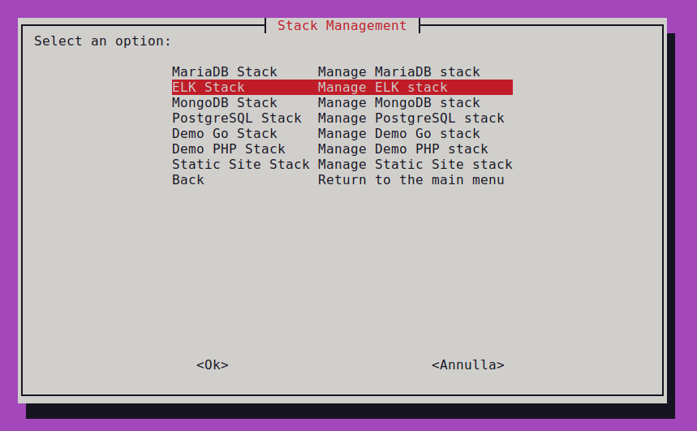
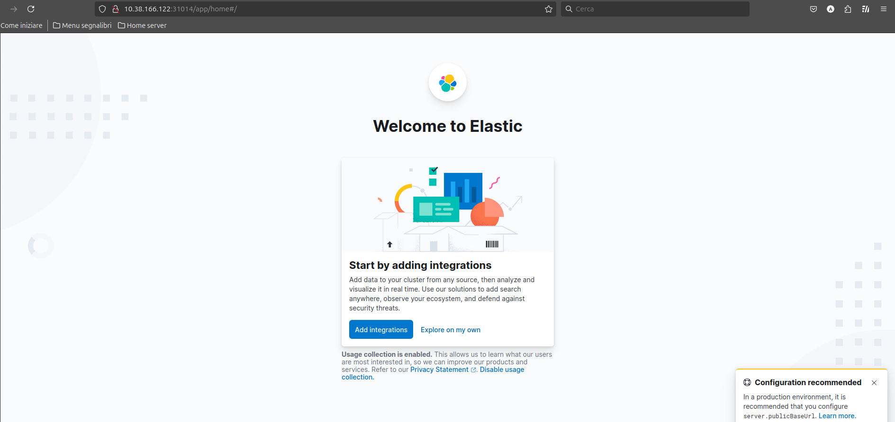

# ELK Stack Deployment

## Menu



## Screenshots




**Minimum Resource Requirements:**

* **Critical:** To successfully deploy the ELK Stack, it is *mandatory* to allocate at least 3GB, preferably 4GB of RAM per node. This can be configured via the environment variable `MAIN_RAM=4Gb` during cluster installation.

**Increasing Memory Allocation for MicroK8s Nodes (Multipass):**

* If you are using Multipass for your MicroK8s nodes, you can increase the memory allocation for each node using the following commands:

    ```bash
    multipass set local.k8s-main.memory=4G
    multipass set local.k8s-node1.memory=4G
    multipass set local.k8s-node2.memory=4G
    ```

    These commands will set the memory allocation for `k8s-main`, `k8s-node1`, and `k8s-node2` to 4GB.

**Accessing Kibana:**

* If a DNS server is configured, navigate to http://kibana.loc in your web browser.
