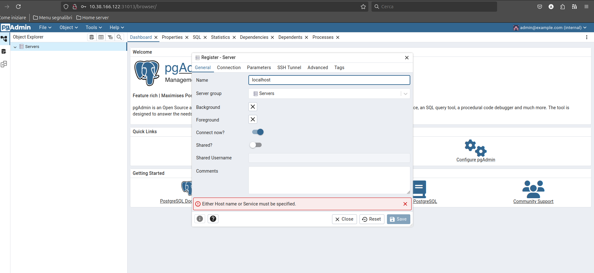

# PostgreSQL Stack Deployment

## Menu

## Screenshots

**Accessing pgAdmin:**

* **Username:** `admin@example.com`
* **Password:** `password`

**Configuring Local Server Connection:**

* **Name:** `localhost`
* **Host name/address:** `postgres`
* **username:** `postgres`
* **Password:** `password`

**Accessing pgAdmin in your Browser:**

* If a DNS server is configured, navigate to http://pgadmin.loc in your web browser.