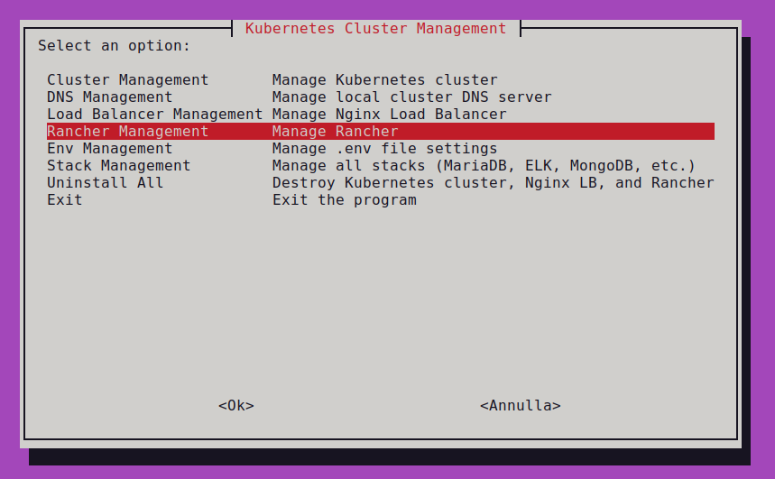
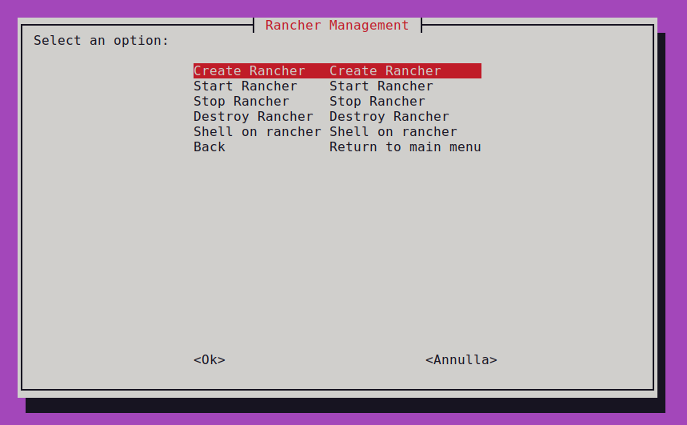
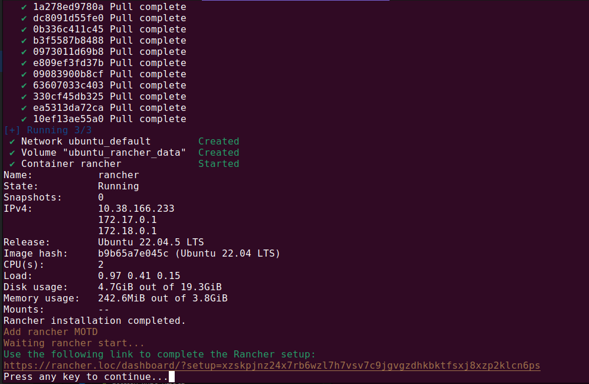
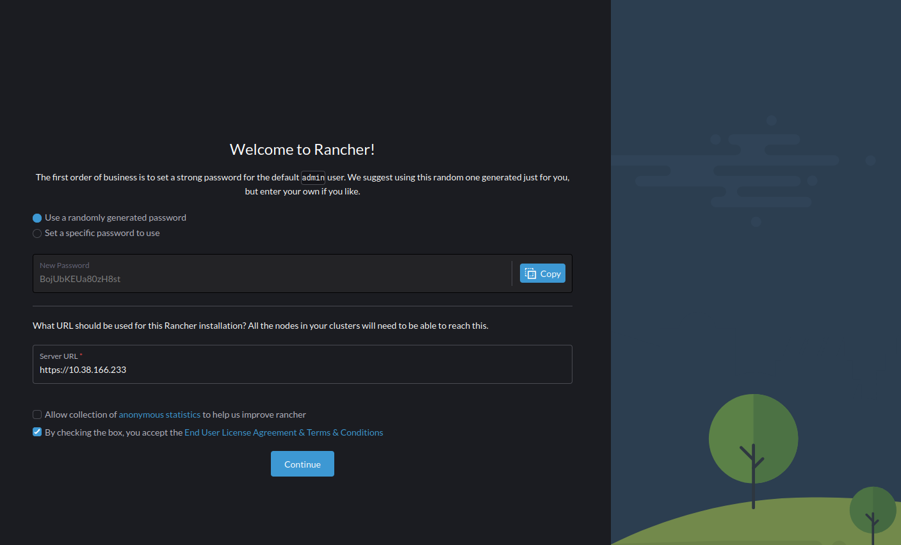
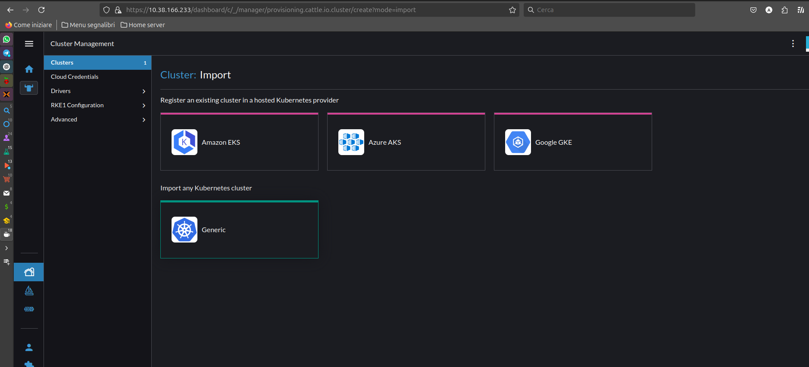
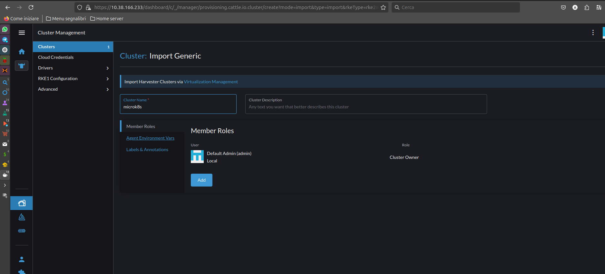
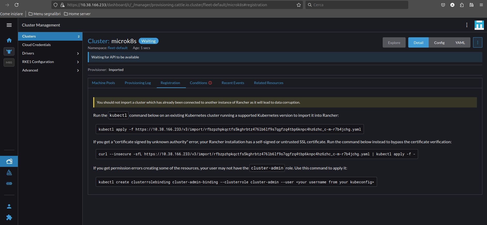
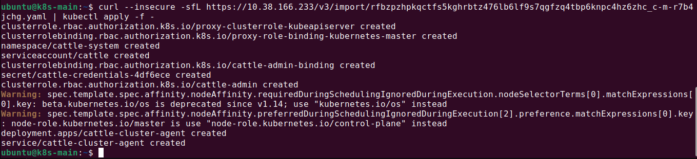
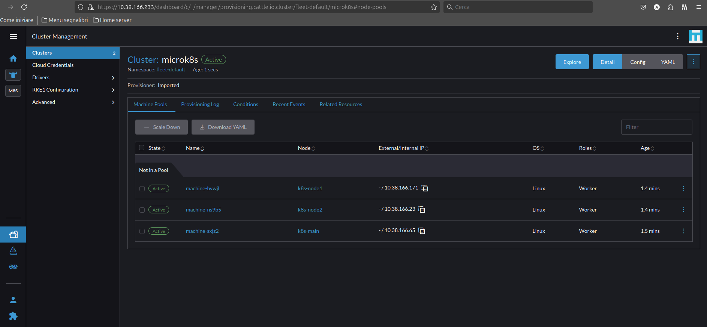

# Rancher Setup and Management

## Menu





**Accessing Rancher without DNS:**

If DNS is not configured, use the following IP address and setup token:

https://&lt;RANCHER_IP>/dashboard/?setup=&lt;SETUP_TOKEN>


Replace `<RANCHER_IP>` with the IP address of your Rancher VM:
```bash
$ multipass info rancher | grep IPv4 | awk '{print $2}'
```
Replace <SETUP_TOKEN> with the token like displayed in the setup.png screenshot.

Accept self-signed certificate


## Screenshots




**Importing an Existing Kubernetes Cluster:**

1.  Select "Import Existing Cluster."
2.  Choose "Generic" as the cluster type.
    
3.  Enter a name for your cluster.
    
4.  **Copy the generated command string (use the second option, signed by an unknown authority).**
    
5.  Open a shell on your `k8s-main` node.
    
6.  Paste the command string to initiate the import process.
    

**Accessing Rancher in your Browser:**

* If a DNS server is configured, navigate to http://rancher.loc in your web browser.
